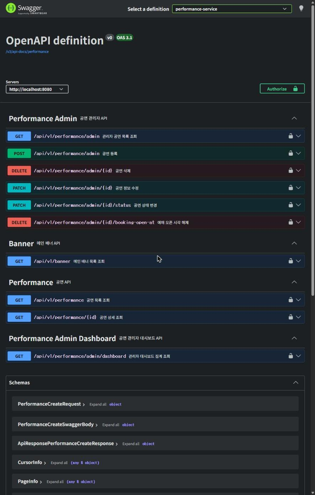

# TicketRush - 대규모 트래픽을 처리하는 MSA 기반 공연 티켓 예매 플랫폼

## 🔥 프로젝트 소개

### 🗓️ 프로젝트 기간

- 2026년 3월 ~ 진행중

### 👥 프로젝트 팀원 소개

|                            프로필                            | 이름  |                     GitHub                     | 담당 파트                                                              |
|:---------------------------------------------------------:|:---:|:----------------------------------------------:|--------------------------------------------------------------------|
|        | 김소희 |       [@50h33](https://github.com/50h33)       | 공통 인프라 구축 · 좌석(seat) · 예매(booking) · 티켓(ticket) · 모니터링 · 부하/성능 테스트 |
|    | 김민주 |   [@calla1102](https://github.com/calla1102)   | 디자인(Figma) · 공연(performance) · 결제(payment) · CI                    |
|  | 김혜림 | [@kimhyerim01](https://github.com/kimhyerim01) | 인증(auth) · 회원(user) · 게이트웨이(gateway) · 배포(CD)                      |

---

## 🎫 TicketRush 서비스 소개

### 💡 개발 배경

인기 공연의 티켓 오픈은 짧은 시간에 트래픽이 폭증하고, 한정된 좌석에 다수의 사용자가 동시에 몰리는 대표적인 **고(高)동시성** 문제 영역입니다. 이 환경에서 발생하는 핵심
난제는 다음과 같습니다.

- **더블 부킹** — 동일 좌석을 여러 사용자가 동시에 선택할 때 중복 예매가 발생
- **실시간성** — 다른 사용자가 선택 중인 좌석을 즉시 반영하지 못하면 예매 실패·불편으로 이어짐
- **분산 트랜잭션 정합성** — 예매 → 결제 → 발권으로 이어지는 흐름에서 "결제는 됐는데 좌석·티켓이 누락"되는 부분 실패를 막아야 함

**TicketRush**는 이 문제들을 다음과 같이 풀어냅니다.

- **Redis 기반 좌석 선점 락 + 멱등 처리**로 더블 부킹을 차단
- **SSE(Server-Sent Events)** 로 좌석 상태를 실시간 스트리밍
- **Kafka 이벤트(Outbox 패턴) + Saga 보상 트랜잭션**으로 서비스 간 최종 일관성을 보장하고, 중간 단계가 실패하면 앞선 작업을 자동으로 보상(취소)

### 📖 개요

**TicketRush**는 공연 티켓 예매를 제공하는 서비스의 백엔드입니다.
좌석 선점 → 예매 → 결제 → 티켓 발급으로 이어지는 예매 흐름을 회원/인증·공연·좌석·예매·결제·티켓 도메인으로 나누고, 각 도메인을 독립적으로 배포·확장 가능한 **MSA**
구조로 설계했습니다.
서비스 간 통신은 동기 호출을 최소화하고 **Kafka 이벤트**를 중심으로 느슨하게 결합하여, 특정 서비스의 장애가 전체로 전파되지 않도록 했습니다.

### ✨ 주요 기능

**(1) 회원 · 인증**

- 이메일/비밀번호 회원가입·로그인, 이메일 인증번호 발송·검증
- OAuth2 소셜 로그인 (카카오 · 네이버 · 구글)
- JWT 발급·재발급(access/refresh) 및 로그아웃

**(2) 공연**

- 공연 목록 조회(장르·가격·상태 필터 + 페이징) 및 상세 조회
- 공연 등록·수정·삭제 및 상태 관리 (관리자, 메인 이미지·3D 모델 업로드)

**(3) 결제**

- Toss Payments 연동 결제 승인 · 취소 · 환불
- PG Webhook 수신 (서명 검증 · 멱등 처리) 및 결제 내역 조회

**(4) 좌석**

- 좌석 배치 및 상태별 수(가능/판매완료/선점) 조회
- SSE 기반 좌석 상태 실시간 스트리밍
- 좌석 선점(락)/해제 — Redis 기반 멱등 처리

**(5) 예매**

- 예매 생성(결제 대기) · 취소 · 만료 처리 및 내 예매 내역 조회
- 좌석 선점 실패 시 예매 자동 취소 (Saga 보상 트랜잭션)

**(6) 티켓**

- 결제 완료 이벤트 기반 티켓 자동 발급 (QR 토큰)
- 입장권 QR 조회 및 검증(서명·만료), 입장(검표) 처리 및 중복 입장 방지

## 🛠 TicketRush 기술 스택

### 1️⃣ 개발 환경 및 사용 기술

| 구분           | 사용 기술                                                        |
|--------------|--------------------------------------------------------------|
| Language     | Java 21                                                      |
| Framework    | Spring Boot 4.0.3, Spring Cloud 2025.1.0 (Gateway / WebFlux) |
| Build        | Gradle (멀티모듈)                                                |
| Database     | MySQL · Spring Data JPA · QueryDSL                           |
| Messaging    | Apache Kafka (KRaft, Outbox 패턴)                              |
| Cache / Lock | Redis · Redisson · ShedLock                                  |
| Auth         | Spring Security · JWT · OAuth2                               |
| API Docs     | springdoc-openapi (Swagger)                                  |
| Code Quality | Spotless (google-java-format) · Checkstyle                   |

### 2️⃣ 모듈 구성

| 모듈                    | 역할                                                              |
|-----------------------|-----------------------------------------------------------------|
| `gateway-service`     | API Gateway (Spring Cloud Gateway / WebFlux), Swagger 통합 진입점    |
| `user-service`        | 회원 도메인                                                          |
| `auth-service`        | 인증/인가 (OAuth2 카카오·구글·네이버, JWT)                                  |
| `performance-service` | 공연 도메인                                                          |
| `booking-service`     | 예매 도메인 (DLT 모니터링·Slack 알림)                                      |
| `payment-service`     | 결제 도메인 (Toss Payments)                                          |
| `seat-service`        | 좌석 도메인 (SSE 실시간 스트림, 분산 락)                                      |
| `ticket-service`      | 티켓 도메인 (QR 토큰)                                                  |
| `common`              | 전 모듈 공통 코드 (ApiResponse, ErrorStatus, PageInfo, Kafka, Redis 등) |

<!--
### 3️⃣ 아키텍처 다이어그램

### 4️⃣ CI/CD 파이프라인
-->

## 🚀 시작하기 (Getting Started)

로컬에서 서비스를 띄우는 절차입니다.

### 1️⃣ 사전 준비물

| 항목 | 버전 | 비고 |
|-----|-----|-----|
| JDK | 21 | 각 모듈 `build.gradle`의 Gradle toolchain 설정 |
| Docker | - | Redis · Kafka · 관측 스택 구동용 |
| MySQL | 8.x | **호스트에 직접 설치**. `docker-compose.yml`에는 MySQL이 없습니다 |

### 2️⃣ 데이터베이스 준비

각 서비스는 `jdbc:mysql://localhost:3306/ticket_rush`로 접속합니다. 스키마만 만들어 두면 테이블은
`ddl-auto=update`가 자동 생성합니다.

```sql
CREATE DATABASE ticket_rush CHARACTER SET utf8mb4;
```

> 운영과 동일한 스키마(generated 컬럼·인덱스 포함)로 시작하려면
> [`deploy/mysql/init/001-ticket-rush-schema.sql`](deploy/mysql/init/001-ticket-rush-schema.sql)을 적용하세요.
> 데이터 모델은 [ERD 문서](docs/erd.md)를 참고하세요.

### 3️⃣ 환경변수 설정

```bash
cp .env.example .env.local
```

`.env.local`을 열어 `[필수]` 표시된 값을 채웁니다. 각 키가 어떤 서비스에서 필수인지는
[`.env.example`](.env.example) 주석에 정리돼 있습니다.

- **`gateway-service`만 띄울 때** — `JWT_SECRET`만 있으면 됩니다 (DB를 쓰지 않습니다)
- **`auth-service`를 띄울 때** — OAuth 3종 · `MAIL_*` · `INTERNAL_API_TOKEN` · `GATEWAY_INTERNAL_TOKEN`이
  모두 기본값 없이 필수입니다. 하나라도 비면 부팅에 실패합니다
- `SPRING_PROFILES_ACTIVE`는 `local` 단독으로 둡니다

### 4️⃣ 인프라 기동

```bash
# 최소 구성 (Redis + Kafka)
docker compose up -d redis kafka

# 관측 스택까지 포함 (Prometheus + Grafana)
docker compose up -d
```

| 컨테이너 | 포트 | 비고 |
|--------|-----|-----|
| Redis | `127.0.0.1:6379` | 좌석 선점 락 · 대기열. keyspace 만료 이벤트(`Ex`) 활성화 |
| Kafka | `127.0.0.1:29092` | KRaft 모드. 기본 파티션 3 |
| Prometheus | `127.0.0.1:9090` | |
| Grafana | `127.0.0.1:3000` | 기본 계정 `admin` / `admin` |

부하 테스트용 `k6`는 `loadtest` 프로파일로 분리돼 있어 위 명령으로는 뜨지 않습니다
([load-test-guide.md](docs/load-test-guide.md) 참고).

### 5️⃣ 애플리케이션 기동

모듈별로 띄웁니다. 필요한 서비스만 골라 띄워도 됩니다.

```bash
# .env.local 을 환경변수로 주입한 뒤 실행
set -a && . ./.env.local && set +a
./gradlew :gateway-service:bootRun
./gradlew :performance-service:bootRun
```

> IntelliJ에서 실행한다면 [EnvFile 플러그인](https://plugins.jetbrains.com/plugin/7861-envfile)으로
> `.env.local`을 주입하도록 실행 구성을 만드세요. `.idea/`는 추적 대상이 아니라 실행 구성이 함께 받아지지 않습니다.

| 서비스 | 포트 | DB |
|------|-----|-----|
| `gateway-service` | 8080 | 미사용 (WebFlux + Redis) |
| `user-service` | 8081 | ✅ |
| `auth-service` | 8082 | ✅ |
| `performance-service` | 8083 | ✅ |
| `booking-service` | 8084 | ✅ |
| `payment-service` | 8085 | ✅ |
| `seat-service` | 8086 | ✅ |
| `ticket-service` | 8087 | ✅ |

API 호출은 게이트웨이 **8080** 하나로 보냅니다. 나머지 포트는 게이트웨이가 내부 라우팅에 쓰는 것으로,
직접 호출하면 게이트웨이가 주입하는 인증 헤더가 없어 동작이 달라집니다.
운영에서는 인터넷에 8080만 열려 있습니다.

`local` 프로파일에서는 더미 데이터가 자동 시딩됩니다 — 공연·배너(`performance-service`), 좌석(`seat-service`).
데이터가 이미 있으면 건너뜁니다.

### 6️⃣ 동작 확인

```bash
curl http://localhost:8080/actuator/health
# {"status":"UP"}
```

---

## 📈 성능 / 부하 테스트

단일 EC2(`m7i-flex.large`, 2 vCPU / 7.6 GiB) 한 대에 앱 8개와 MySQL·Redis·Kafka·관측 스택이 함께 올라간 구성에서 **회차 23번**을 측정했습니다.

| 무엇을 | 전 → 후 | 회차 |
|-----|-----|-----|
| 좌석맵 응답 크기 (gzip) | 174,615 B → 8,405 B | #505 |
| 좌석 집계 최대 처리량 (커버링 인덱스) | 254.84 → 396.75 rps | #529 |
| 좌석맵 서버 응답, 80 계단 (JSON 캐싱) | 741.04 ms → 10.11 ms | #539 |
| 예매 파이프라인 드레인율 (컨슈머 concurrency 3) | 43.0/s → 96.6/s | #598 |

각 수치는 **같은 회차 안에서 변수 하나만 바꿔 얻은 전/후**이며, 서로 다른 회차의 값끼리는 잇지 않았습니다
(#539만 before/after 이미지가 달라 다른 변경이 섞이며, 그 한계는 리포트에 적어 두었습니다).
병목이 회선 → 컨테이너 메모리 → 호스트 CPU → 유입 제어로 옮겨간 서사와, 아직 증명하지 못한
한계(1만 명 동시 대기 미재현·수평 확장 미검증 등)는 [performance-report.md](docs/performance-report.md)에 있습니다.

---

## 📖 API 문서 (Swagger)

게이트웨이가 7개 서비스의 OpenAPI 문서를 **하나의 Swagger UI로 통합**합니다.
우측 상단 드롭다운에서 서비스를 전환합니다.

| 환경 | 주소 |
|-----|-----|
| 로컬 | http://localhost:8080/swagger-ui.html |
| 운영 | https://api.ticketrush.store/swagger-ui.html |

- `/swagger-ui.html`은 `/swagger-ui/index.html`로 리다이렉트(302)됩니다
- 인증 없이 접근할 수 있습니다 (`/swagger-ui/**`, `/v3/api-docs/**`가 게이트웨이 허용 목록에 등록돼 있습니다)
- 서비스별 원본 스펙은 `/v3/api-docs/{user|auth|performance|booking|payment|seat|ticket}`에서 직접 받을 수 있습니다
- 해당 서비스가 떠 있지 않으면 그 항목만 로딩에 실패합니다 — 게이트웨이가 각 서비스로 프록시하는 구조이기 때문입니다




## 📚 Deep Dive Docs

| 문서                                                            | 내용                          |
|---------------------------------------------------------------|-----------------------------|
| [AGENTS.md](AGENTS.md)                                        | 도구 중립 AI 진입점 / 문서 라우팅       |
| [CLAUDE.md](CLAUDE.md)                                        | 아키텍처 개요 + AI 작업 규칙          |
| [backend-convention.md](docs/backend-convention.md)           | 코딩·협업 컨벤션, 버전 정보 (SSOT)     |
| [ddd-directory-structure.md](docs/ddd-directory-structure.md) | DDD 디렉토리 구조                 |
| [erd.md](docs/erd.md)                                         | 데이터 모델 / ERD               |
| [kafka-event-guide.md](docs/kafka-event-guide.md)             | Kafka 이벤트 / Outbox / DLT 정책 |
| [mapstruct-guide.md](docs/mapstruct-guide.md)                 | MapStruct Mapper 구조         |
| [ai-workflow-guide.md](docs/ai-workflow-guide.md)             | Claude Code AI 개발 워크플로우     |
| [load-test-guide.md](docs/load-test-guide.md)                 | 부하 테스트 실행 런북              |
| [performance-report.md](docs/performance-report.md)           | 성능 측정 종합 리포트 (병목 이동·개선 전후·한계) |
| [adr/](docs/adr/)                                             | 아키텍처 결정 기록(ADR)             |
