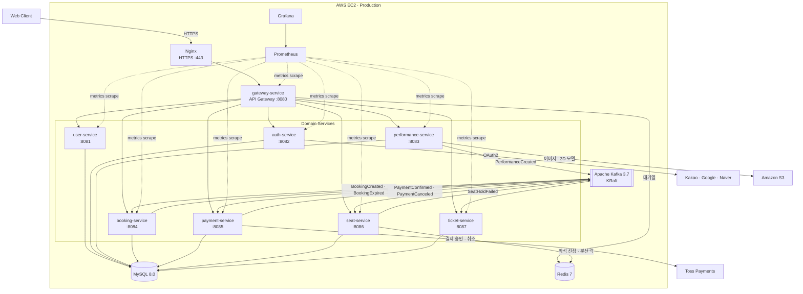
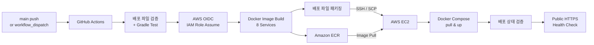

# TicketRush - 대규모 트래픽을 처리하는 MSA 기반 공연 티켓 예매 플랫폼

<!-- 배지에 ?branch= 를 붙이지 마세요. 두 워크플로 모두 pull_request 트리거뿐이라 브랜치 지정 시 "no status" 가 됩니다. -->
[](https://github.com/TicketRush/TicketRush-backend/actions/workflows/ci.yml)
[](https://github.com/TicketRush/TicketRush-backend/actions/workflows/schema-validate.yml)

## 🔥 프로젝트 소개

### 🗓️ 프로젝트 기간

- 2026년 3월 ~ 진행중

### 👥 프로젝트 팀원 소개

|                            프로필                            | 이름  |                     GitHub                     | 담당 파트                                                              |
|:---------------------------------------------------------:|:---:|:----------------------------------------------:|--------------------------------------------------------------------|
|        | 김소희 |       [@50h33](https://github.com/50h33)       | 공통 인프라 구축 · 좌석(seat) · 예매(booking) · 티켓(ticket) · 모니터링 · 부하/성능 테스트 |
|    | 김민주 |   [@calla1102](https://github.com/calla1102)   | 디자인(Figma) · 공연(performance) · 결제(payment) · CI                    |
|  | 김혜림 | [@kimhyerim01](https://github.com/kimhyerim01) | 인증(auth) · 회원(user) · 게이트웨이(gateway) · 배포(CD)                      |

---

## 🎫 TicketRush 서비스 소개

### 💡 개발 배경

인기 공연의 티켓 오픈은 짧은 시간에 트래픽이 폭증하고, 한정된 좌석에 다수의 사용자가 동시에 몰리는 대표적인 **고(高)동시성** 문제 영역입니다. 이 환경에서 발생하는 핵심
난제는 다음과 같습니다.

- **더블 부킹** — 동일 좌석을 여러 사용자가 동시에 선택할 때 중복 예매가 발생
- **실시간성** — 다른 사용자가 선택 중인 좌석을 즉시 반영하지 못하면 예매 실패·불편으로 이어짐
- **분산 트랜잭션 정합성** — 예매 → 결제 → 발권으로 이어지는 흐름에서 "결제는 됐는데 좌석·티켓이 누락"되는 부분 실패를 막아야 함

**TicketRush**는 이 문제들을 다음과 같이 풀어냅니다.

- **Redis 기반 좌석 선점 락 + 멱등 처리**로 더블 부킹을 차단
- **SSE(Server-Sent Events)** 로 좌석 상태를 실시간 스트리밍
- **Kafka 이벤트(Outbox 패턴) + Saga 보상 트랜잭션**으로 서비스 간 최종 일관성을 보장하고, 중간 단계가 실패하면 앞선 작업을 자동으로 보상(취소)

### 📖 개요

**TicketRush**는 공연 티켓 예매를 제공하는 서비스의 백엔드입니다.
좌석 선점 → 예매 → 결제 → 티켓 발급으로 이어지는 예매 흐름을 회원/인증·공연·좌석·예매·결제·티켓 도메인으로 나누고, 각 도메인을 독립적으로 배포·확장 가능한 **MSA**
구조로 설계했습니다.
서비스 간 통신은 동기 호출을 최소화하고 **Kafka 이벤트**를 중심으로 느슨하게 결합하여, 특정 서비스의 장애가 전체로 전파되지 않도록 했습니다.

### ✨ 주요 기능

**(1) 회원 · 인증**

- 이메일/비밀번호 회원가입·로그인, 이메일 인증번호 발송·검증
- OAuth2 소셜 로그인 (카카오 · 네이버 · 구글)
- JWT 발급·재발급(access/refresh) 및 로그아웃

**(2) 공연**

- 공연 목록 조회(장르·가격·상태 필터 + 페이징) 및 상세 조회
- 공연 등록·수정·삭제 및 상태 관리 (관리자, 메인 이미지·3D 모델 업로드)

**(3) 결제**

- Toss Payments 연동 결제 승인 · 취소 · 환불
- PG Webhook 수신 (서명 검증 · 멱등 처리) 및 결제 내역 조회

**(4) 좌석**

- 좌석 배치 및 상태별 수(가능/판매완료/선점) 조회
- SSE 기반 좌석 상태 실시간 스트리밍
- 좌석 선점(락)/해제 — Redis 기반 멱등 처리

**(5) 예매**

- 예매 생성(결제 대기) · 취소 · 만료 처리 및 내 예매 내역 조회
- 좌석 선점 실패 시 예매 자동 취소 (Saga 보상 트랜잭션)

**(6) 티켓**

- 결제 완료 이벤트 기반 티켓 자동 발급 (QR 토큰)
- 입장권 QR 조회 및 검증(서명·만료), 입장(검표) 처리 및 중복 입장 방지

## 🛠 TicketRush 기술 스택

### 1️⃣ 개발 환경 및 사용 기술

| 구분           | 사용 기술                                                        |
|--------------|--------------------------------------------------------------|
| Language     | Java 21                                                      |
| Framework    | Spring Boot 4.0.3, Spring Cloud 2025.1.0 (Gateway / WebFlux) |
| Build        | Gradle (멀티모듈)                                                |
| Database     | MySQL · Spring Data JPA · QueryDSL                           |
| Messaging    | Apache Kafka (KRaft, Outbox 패턴)                              |
| Cache / Lock | Redis · Redisson · ShedLock                                  |
| Auth         | Spring Security · JWT · OAuth2                               |
| API Docs     | springdoc-openapi (Swagger)                                  |
| Code Quality | Spotless (google-java-format) · Checkstyle                   |

### 2️⃣ 모듈 구성

| 모듈                    | 역할                                                              |
|-----------------------|-----------------------------------------------------------------|
| `gateway-service`     | API Gateway (Spring Cloud Gateway / WebFlux), Swagger 통합 진입점    |
| `user-service`        | 회원 도메인                                                          |
| `auth-service`        | 인증/인가 (OAuth2 카카오·구글·네이버, JWT)                                  |
| `performance-service` | 공연 도메인                                                          |
| `booking-service`     | 예매 도메인 (DLT 모니터링·Slack 알림)                                      |
| `payment-service`     | 결제 도메인 (Toss Payments)                                          |
| `seat-service`        | 좌석 도메인 (SSE 실시간 스트림, 분산 락)                                      |
| `ticket-service`      | 티켓 도메인 (QR 토큰)                                                  |
| `common`              | 전 모듈 공통 코드 (ApiResponse, ErrorStatus, PageInfo, Kafka, Redis 등) |

### 3️⃣ 아키텍처 다이어그램

TicketRush는 API Gateway를 단일 진입점으로 두고, 인증·회원·공연·예매·결제·좌석·티켓 도메인을 독립 서비스로 분리한 **MSA 구조**입니다.

운영 환경에서는 Nginx가 외부 HTTPS 요청을 받아 `gateway-service`로 전달하고, Gateway가 요청 경로에 따라 각 도메인 서비스로 라우팅합니다.
서비스 간 상태 변경은 Kafka 이벤트를 중심으로 처리하며, 좌석 선점·대기열처럼 빠른 상태 접근과 동시성 제어가 필요한 영역에는 Redis를 사용합니다.



**주요 흐름**

* **외부 요청** — Client → Nginx → Gateway → 각 도메인 서비스
* **예매 처리** — 좌석 선점 → 예매 생성 → 결제 → 예매 확정·티켓 발급을 Kafka 이벤트로 연결
* **동시성 제어** — Redis를 이용해 좌석 선점과 대기열 상태를 관리
* **이벤트 정합성** — Kafka 기반 비동기 이벤트와 Outbox/Inbox 패턴으로 이벤트 유실·중복 처리에 대응
* **관측** — Prometheus가 애플리케이션·인프라 지표를 수집하고 Grafana에서 시각화

> 현재 운영 환경은 **단일 EC2**의 Docker Compose에 애플리케이션 8개와 MySQL·Redis·Kafka·Prometheus·Grafana 등의 인프라를 함께 실행합니다.
> DB·Redis·Kafka의 접속 정보는 환경변수로 외부화되어 있어 추후 RDS·ElastiCache·MSK 등 관리형 인프라로 이전할 수 있도록 구성되어 있습니다.


### 4️⃣ CI/CD 파이프라인

#### CI (지속적 통합)

`develop`으로 향하는 PR에서는 아래 워크플로 셋이 돕니다(이 밖에 `cd.yml`·`weekly-scrum.yml`이 있습니다).

> 머지 조건과 branch protection 설정은 [`docs/backend-convention.md`](docs/backend-convention.md) §1 "검증 파이프라인"이 SSOT입니다. 여기서는 각 워크플로가 **무엇을 검사하는지**만 다룹니다.

| 워크플로              | 파일                     | 트리거                                       | 하는 일                    |
|-------------------|------------------------|-------------------------------------------|-------------------------|
| **CI**            | `ci.yml`               | PR → `develop` (opened·synchronize·reopened) | 정적 검사 → 테스트 → 빌드 → 설정 대조 |
| **Schema Validate** | `schema-validate.yml`  | PR → `develop` (opened·synchronize·reopened) | 엔티티↔스키마 스냅샷 drift 감지    |
| **PR Title Check**  | `pr-title.yml`         | 모든 PR (opened·edited·reopened)             | PR 제목 형식 검사             |

앞의 두 워크플로는 `concurrency` 그룹을 두어, 같은 PR에 연속으로 push하면 진행 중이던 이전 run을 취소합니다.

**빌드 흐름** (`ci.yml`)

JDK 21(temurin) 설치와 Gradle 캐시 복원 후 아래 순서로 진행합니다.

```bash
./gradlew spotlessCheck                    # google-java-format 포맷 검사
./gradlew checkstyleMain checkstyleTest    # 정적 검사 (테스트 코드 포함)
./gradlew test                             # 전 모듈 테스트
./gradlew build -x test                    # 빌드
```

- **`checkstyleTest`도 함께 돌기 때문에 테스트 코드의 위반도 CI에서 걸립니다.** 로컬에서 `checkstyleMain`만 확인하고 올리면 여기서 떨어집니다.
- 마지막으로 **Prometheus scrape 타깃을 정적 대조**합니다(#380). `monitoring/prometheus.aws.yml`과 `deploy/docker-compose.prod.yml`을 맞춰 보고, 배포되는데 스크랩하지 않거나 스크랩하는데 배포되지 않는 타깃이 있으면 실패합니다. CD는 `main`에서만 돌아 타깃이 틀렸다는 사실이 실배포 전에는 드러나지 않으므로 PR 단계에서 잡습니다.
- 실패 시 `checkstyle-report`가, 결과와 무관하게 `test-report`가 아티팩트로 업로드됩니다.

**스키마 drift 감지** (`schema-validate.yml`, #408)

local 프로파일은 `ddl-auto=update`이고 `./gradlew test`는 H2를 쓰기 때문에, 엔티티와 스키마 스냅샷이 어긋나도 로컬에서는 증상이 없습니다. prod(`validate`)에서 **부팅 실패**로만 드러나므로, 같은 조건을 CI에서 미리 재현합니다.

1. 빈 MySQL 8.0에 `deploy/mysql/init/001-ticket-rush-schema.sql` 적재
2. 릴레이 조회 스모크 — nativeQuery라 저장소 어디에서도 실행되지 않는 SQL과 그 인덱스 존재 여부를 실제 MySQL로 확인
3. 엔티티를 가진 6개 서비스(`user`·`performance`·`seat`·`booking`·`payment`·`ticket`)를 `ddl-auto=validate`로 부팅

gateway(DB 미사용)와 auth(`@Entity` 0개, 테이블은 user-service 소유)는 검증 대상이 아닙니다.

> ⚠️ `validate`는 컬럼 존재·타입은 잡지만 **컬럼 길이·인덱스·유니크/FK·nullable 차이는 검출하지 않습니다.** 인덱스를 추가·변경할 때는 스냅샷 반영을 별도로 확인해야 합니다.

**PR 제목 규칙** (`pr-title.yml`)

`[Type] #이슈번호 설명` 형식이어야 하며, 허용 Type은 `Feat` `Fix` `Refactor` `Docs` `Test` `Chore` `Infra`입니다.

```
[Feat] #23 로그인 API 구현          # 단일 이슈
[Chore] #1, 2, 4 설정 파일 업데이트   # 다중 이슈
```

**로컬에서 미리 통과시키기**

```bash
./gradlew spotlessApply                    # 포맷 자동 교정
./gradlew checkstyleMain checkstyleTest
./gradlew test
```

#### CD (지속적 배포)

운영 배포는 [`.github/workflows/cd.yml`](.github/workflows/cd.yml)에서 관리합니다.

`main` 브랜치에 변경 사항이 push되거나 GitHub Actions에서 `workflow_dispatch`로 수동 실행하면 CD 파이프라인이 시작됩니다.
동일 운영 환경에 여러 배포가 동시에 실행되지 않도록 `concurrency` 그룹을 사용하며, 진행 중인 배포를 취소하지 않고 순차적으로 실행합니다.



**배포 흐름**

1. **배포 파일 검증 및 테스트**

    * `Dockerfile`, `deploy/docker-compose.prod.yml`, `deploy/.env.prod.example` 및 배포 스크립트의 존재 여부를 확인합니다.
    * `docker compose config`로 운영 Compose 설정을 검증합니다.
    * `./gradlew test`로 전체 모듈 테스트를 수행합니다.
    * 실제 운영 Secret이 담긴 `deploy/.env`가 저장소에 포함되어 있으면 배포를 중단합니다.

2. **AWS 인증**

    * GitHub Actions의 OIDC를 통해 배포용 IAM Role을 Assume합니다.
    * 고정 AWS Access Key를 저장하지 않고 임시 자격 증명으로 Amazon ECR에 접근합니다.

3. **Docker 이미지 Build & Push**

    * `gateway-service`와 7개 도메인 서비스까지 총 8개의 이미지를 빌드합니다.
    * 이미지 태그에는 배포 대상 Git commit SHA(`github.sha`)를 사용합니다.
    * 각 이미지를 서비스별 Amazon ECR Repository에 Push합니다.

4. **배포 파일 전달**

    * `deploy/`와 `monitoring/` 설정을 배포 번들로 패키징합니다.
    * `.env`, `.env.local` 등 실제 환경변수 파일은 배포 번들에서 제외합니다.
    * SSH/SCP를 통해 배포 번들을 EC2에 전달합니다.

5. **EC2 배포**

    * EC2에서 Amazon ECR에 로그인합니다.
    * 현재 실행 중인 애플리케이션과 `CURRENT_RELEASE`, `.env`의 `IMAGE_TAG`가 일치하는지 먼저 검증합니다.
    * 사용하지 않는 이전 Docker 이미지를 정리한 뒤 새 이미지를 Pull합니다.
    * `docker compose up -d --remove-orphans`로 서비스를 갱신합니다.
    * Prometheus·Grafana는 최신 모니터링 설정을 반영하도록 다시 생성합니다.

6. **배포 상태 검증**

    * 모든 컨테이너의 실행·Health 상태를 확인합니다.
    * 배포 중 OOM Kill 또는 비정상 Restart가 발생하지 않았는지 검사합니다.
    * 각 Spring Boot 애플리케이션이 정상 기동되었는지 로그를 통해 확인합니다.
    * Gateway의 내부 Actuator(`127.0.0.1:8090`)가 `UP`인지 확인합니다.
    * Prometheus의 기대 scrape target이 모두 `UP`인지 확인합니다.
    * 컨테이너 메모리 시계열이 정상적으로 수집되는지 검사합니다.
    * Nginx를 통한 로컬 HTTPS 경로가 정상인지 확인합니다.
    * 실행 중인 8개 애플리케이션 이미지가 이번 배포의 Git commit SHA와 일치하는지 최종 검증합니다.

7. **릴리스 확정 및 외부 Health Check**

    * 모든 내부 검증이 성공한 경우에만 이번 Git commit SHA를 `CURRENT_RELEASE`와 `.env`의 `IMAGE_TAG`에 기록합니다.
    * 기존 릴리스는 `PREVIOUS_RELEASE`에 기록하여 이전 이미지 버전을 추적할 수 있도록 합니다.
    * 마지막으로 별도 Job에서 `https://api.ticketrush.store/actuator/health`를 호출하여 HTTP 200과 `"status":"UP"`을 확인합니다.

> 현재 CD는 배포 실패 시 **자동 롤백을 수행하지 않습니다.** 직전 릴리스 정보를 `PREVIOUS_RELEASE`에 보존하고 ECR의 기존 이미지를 이용해 이전 버전으로 복구할 수 있는 구조입니다.

#### 운영 배포 환경

운영 애플리케이션은 Spring의 `prod` 프로파일로 실행합니다.

```text
SPRING_PROFILES_ACTIVE=prod
```

운영 환경변수 템플릿은 [`deploy/.env.prod.example`](deploy/.env.prod.example)에서 관리하고, 실제 운영 값은 EC2의 `deploy/.env`에 저장합니다.
`deploy/.env`에는 Secret과 인프라 접속 정보가 포함되므로 Git에 커밋하지 않습니다.

| 구분        | 주요 설정                                                               |
| --------- | ------------------------------------------------------------------- |
| Spring    | `SPRING_PROFILES_ACTIVE`, `SPRING_JPA_HIBERNATE_DDL_AUTO`           |
| DB        | `DB_HOST`, `DB_PORT`, `DB_NAME`, `MYSQL_USERNAME`, `MYSQL_PASSWORD` |
| Redis     | `REDIS_HOST`, `REDIS_PORT`, `REDIS_PASSWORD`                        |
| Kafka     | `KAFKA_BOOTSTRAP_SERVERS`, `SPRING_KAFKA_LISTENER_CONCURRENCY`      |
| AWS / ECR | `AWS_REGION`, `ECR_REGISTRY`, `IMAGE_TAG`                           |
| Gateway   | `JWT_SECRET`, `CORS_ALLOWED_ORIGIN`, 각 서비스 Host                     |
| 인증        | OAuth Client 정보, Mail 정보, 내부 API Token                              |
| 외부 서비스    | S3, Toss Payments, Slack Webhook                                    |
| 관측        | Grafana 관리자 계정                                                      |

운영 접속 정보는 코드나 `application-prod.yml`에 고정하지 않고 환경변수로 주입합니다.
DB·Redis·Kafka 또한 각각 `DB_HOST`, `REDIS_HOST`, `KAFKA_BOOTSTRAP_SERVERS`로 접속 대상을 분리하여 인프라 변경이 애플리케이션 코드 변경으로 이어지지 않도록 구성했습니다.

현재 `docker-compose.prod.yml`에서는 **MySQL·Redis·Kafka를 애플리케이션과 동일한 EC2에서 컨테이너로 실행**합니다. 접속 정보가 외부화되어 있으므로 향후 RDS·ElastiCache·MSK 등 관리형 인프라로 이전할 수 있습니다.


## 🚀 시작하기 (Getting Started)

로컬에서 서비스를 띄우는 절차입니다.

### 1️⃣ 사전 준비물

| 항목 | 버전 | 비고 |
|-----|-----|-----|
| JDK | 21 | 각 모듈 `build.gradle`의 Gradle toolchain 설정 |
| Docker | - | Redis · Kafka · 관측 스택 구동용 |
| MySQL | 8.x | **호스트에 직접 설치**. `docker-compose.yml`에는 MySQL이 없습니다 |

### 2️⃣ 데이터베이스 준비

각 서비스는 `jdbc:mysql://localhost:3306/ticket_rush`로 접속합니다. 스키마만 만들어 두면 테이블은
`ddl-auto=update`가 자동 생성합니다.

```sql
CREATE DATABASE ticket_rush CHARACTER SET utf8mb4;
```

> 운영과 동일한 스키마(generated 컬럼·인덱스 포함)로 시작하려면
> [`deploy/mysql/init/001-ticket-rush-schema.sql`](deploy/mysql/init/001-ticket-rush-schema.sql)을 적용하세요.
> 데이터 모델은 [ERD 문서](docs/erd.md)를 참고하세요.

### 3️⃣ 환경변수 설정

```bash
cp .env.example .env.local
```

`.env.local`을 열어 `[필수]` 표시된 값을 채웁니다. 각 키가 어떤 서비스에서 필수인지는
[`.env.example`](.env.example) 주석에 정리돼 있습니다.

- **`gateway-service`만 띄울 때** — `JWT_SECRET`만 있으면 됩니다 (DB를 쓰지 않습니다)
- **`auth-service`를 띄울 때** — OAuth 3종 · `MAIL_*` · `INTERNAL_API_TOKEN` · `GATEWAY_INTERNAL_TOKEN`이
  모두 기본값 없이 필수입니다. 하나라도 비면 부팅에 실패합니다
- `SPRING_PROFILES_ACTIVE`는 `local` 단독으로 둡니다

### 4️⃣ 인프라 기동

```bash
# 최소 구성 (Redis + Kafka)
docker compose up -d redis kafka

# 관측 스택까지 포함 (Prometheus + Grafana)
docker compose up -d
```

| 컨테이너 | 포트 | 비고 |
|--------|-----|-----|
| Redis | `127.0.0.1:6379` | 좌석 선점 락 · 대기열. keyspace 만료 이벤트(`Ex`) 활성화 |
| Kafka | `127.0.0.1:29092` | KRaft 모드. 기본 파티션 3 |
| Prometheus | `127.0.0.1:9090` | |
| Grafana | `127.0.0.1:3000` | 기본 계정 `admin` / `admin` |

부하 테스트용 `k6`는 `loadtest` 프로파일로 분리돼 있어 위 명령으로는 뜨지 않습니다
([load-test-guide.md](docs/load-test-guide.md) 참고).

### 5️⃣ 애플리케이션 기동

모듈별로 띄웁니다. 필요한 서비스만 골라 띄워도 됩니다.

```bash
# .env.local 을 환경변수로 주입한 뒤 실행
set -a && . ./.env.local && set +a
./gradlew :gateway-service:bootRun
./gradlew :performance-service:bootRun
```

> IntelliJ에서 실행한다면 [EnvFile 플러그인](https://plugins.jetbrains.com/plugin/7861-envfile)으로
> `.env.local`을 주입하도록 실행 구성을 만드세요. `.idea/`는 추적 대상이 아니라 실행 구성이 함께 받아지지 않습니다.

| 서비스 | 포트 | DB |
|------|-----|-----|
| `gateway-service` | 8080 | 미사용 (WebFlux + Redis) |
| `user-service` | 8081 | ✅ |
| `auth-service` | 8082 | ✅ |
| `performance-service` | 8083 | ✅ |
| `booking-service` | 8084 | ✅ |
| `payment-service` | 8085 | ✅ |
| `seat-service` | 8086 | ✅ |
| `ticket-service` | 8087 | ✅ |

API 호출은 게이트웨이 **8080** 하나로 보냅니다. 나머지 서비스 포트는 게이트웨이가 내부 라우팅에 사용하는 것으로,
직접 호출하면 게이트웨이가 주입하는 인증 헤더가 없어 동작이 달라집니다.

운영 환경에서는 **Nginx의 HTTPS 443 포트만 외부 요청의 진입점으로 사용**하며, `gateway-service`의 8080과
Actuator 관리 포트 8090은 EC2의 `127.0.0.1`에만 바인딩됩니다. 나머지 7개 도메인 서비스는 포트를 외부에 publish하지 않고
Docker Compose 내부 네트워크에서만 통신합니다.


`local` 프로파일에서는 더미 데이터가 자동 시딩됩니다 — 공연·배너(`performance-service`), 좌석(`seat-service`).
데이터가 이미 있으면 건너뜁니다.

### 6️⃣ 동작 확인

```bash
curl http://localhost:8080/actuator/health
# {"status":"UP"}
```

---

## 📈 성능 / 부하 테스트

단일 EC2(`m7i-flex.large`, 2 vCPU / 7.6 GiB) 한 대에 앱 8개와 MySQL·Redis·Kafka·관측 스택이 함께 올라간 구성에서 **회차 23개**를 측정했습니다.

| 무엇을 | 전 → 후 | 회차 |
|-----|-----|-----|
| 좌석맵 응답 크기 (gzip) | 174,615 B → 8,405 B | #505 |
| 좌석 집계 최대 처리량 (커버링 인덱스) | 254.84 → 396.75 rps | #529 |
| 좌석맵 서버 응답, 80 계단 (JSON 캐싱) | 741.04 ms → 10.11 ms | #539 |
| 예매 파이프라인 드레인율 (컨슈머 concurrency 3) | 43.0/s → 96.6/s | #598 |

각 수치는 **같은 회차 안에서 얻은 전/후**이며, 서로 다른 회차의 값끼리는 잇지 않았습니다.
회차마다 무엇이 통제됐고 무엇이 섞였는지는 리포트의 `대조 범위` 열에 적어 두었습니다.
병목이 회선 → 컨테이너 메모리 → 호스트 CPU → 유입 제어로 옮겨간 서사와, 아직 증명하지 못한
한계(1만 명 동시 대기 미재현·수평 확장 미검증 등)는 [performance-report.md](docs/performance-report.md)에 있습니다.

이 수치들에서 거꾸로 계산한 **예상 트래픽·인프라 설계 기준**(일평균 사용자 수·피크 TPS·서버 스펙)은
[capacity-planning.md](docs/capacity-planning.md)에 있습니다.

---

## 📖 API 문서 (Swagger)

게이트웨이가 7개 서비스의 OpenAPI 문서를 **하나의 Swagger UI로 통합**합니다.
우측 상단 드롭다운에서 서비스를 전환합니다.

| 환경 | 주소 |
|-----|-----|
| 로컬 | http://localhost:8080/swagger-ui.html |
| 운영 | https://api.ticketrush.store/swagger-ui.html |

- `/swagger-ui.html`은 `/swagger-ui/index.html`로 리다이렉트(302)됩니다
- 인증 없이 접근할 수 있습니다 (`/swagger-ui/**`, `/v3/api-docs/**`가 게이트웨이 허용 목록에 등록돼 있습니다)
- 서비스별 원본 스펙은 `/v3/api-docs/{user|auth|performance|booking|payment|seat|ticket}`에서 직접 받을 수 있습니다
- 해당 서비스가 떠 있지 않으면 그 항목만 로딩에 실패합니다 — 게이트웨이가 각 서비스로 프록시하는 구조이기 때문입니다


## 📚 Deep Dive Docs

| 문서                                                            | 내용                          |
|---------------------------------------------------------------|-----------------------------|
| [AGENTS.md](AGENTS.md)                                        | 도구 중립 AI 진입점 / 문서 라우팅       |
| [CLAUDE.md](CLAUDE.md)                                        | 아키텍처 개요 + AI 작업 규칙          |
| [backend-convention.md](docs/backend-convention.md)           | 코딩·협업 컨벤션, 버전 정보 (SSOT)     |
| [ddd-directory-structure.md](docs/ddd-directory-structure.md) | DDD 디렉토리 구조                 |
| [erd.md](docs/erd.md)                                         | 데이터 모델 / ERD               |
| [kafka-event-guide.md](docs/kafka-event-guide.md)             | Kafka 이벤트 / Outbox / DLT 정책 |
| [mapstruct-guide.md](docs/mapstruct-guide.md)                 | MapStruct Mapper 구조         |
| [ai-workflow-guide.md](docs/ai-workflow-guide.md)             | Claude Code AI 개발 워크플로우     |
| [load-test-guide.md](docs/load-test-guide.md)                 | 부하 테스트 실행 런북              |
| [performance-report.md](docs/performance-report.md)           | 성능 측정 종합 리포트 (병목 이동·개선 전후·한계) |
| [capacity-planning.md](docs/capacity-planning.md)             | 예상 트래픽·인프라 설계 기준 (실측 역산) |
| [adr/](docs/adr/)                                             | 아키텍처 결정 기록(ADR)             |
