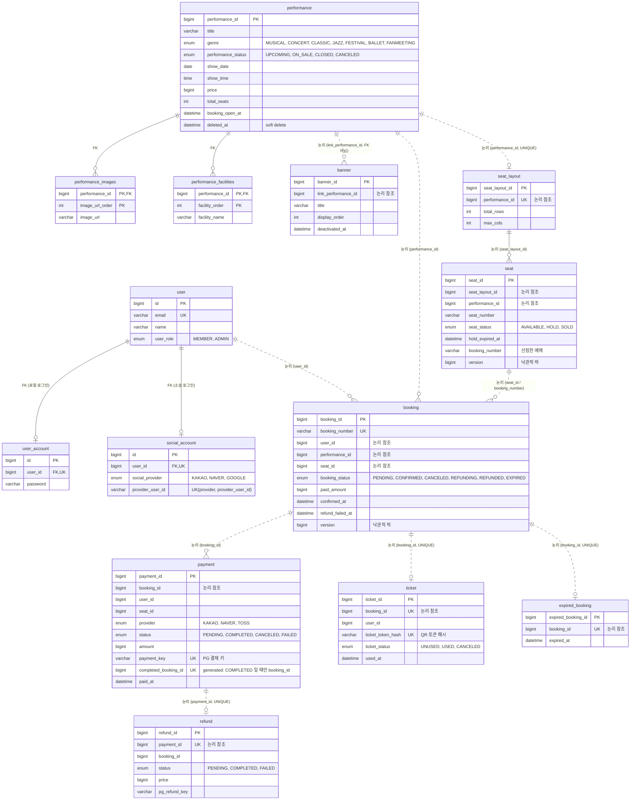

# ERD / 데이터 모델

TicketRush 의 데이터 모델이다. **전체 컬럼 정의의 SSOT 는
[`deploy/mysql/init/001-ticket-rush-schema.sql`](../deploy/mysql/init/001-ticket-rush-schema.sql)**(운영 스키마 스냅샷)이며,
이 문서는 그 스냅샷을 관계 중심으로 읽기 쉽게 옮긴 것이다. 컬럼 타입·길이·인덱스가 궁금하면 스냅샷을 본다.

---

## 이 ERD 를 읽기 전에 — 일반 ERD 와 다른 점

MSA 라서 통상적인 ERD 와 다르게 읽어야 한다.

**1. 물리적으로는 스키마 하나, 논리적으로는 서비스 7개**
전 서비스가 같은 MySQL 스키마 `ticket_rush` 를 쓴다. 테이블이 한곳에 모여 있다고 해서 아무 서비스나
아무 테이블을 읽는 건 아니다. **각 테이블은 소유 서비스만 접근**하고, 다른 서비스는 API 또는 Kafka 이벤트로만
그 데이터에 닿는다.

**2. 서비스 경계를 넘는 FK 가 없다**
스키마 전체의 실제 FOREIGN KEY 는 **4개뿐**이고 모두 한 서비스 안에서 닫혀 있다.

| FK | 서비스 |
|---|---|
| `performance_images.performance_id` → `performance` | performance |
| `performance_facilities.performance_id` → `performance` | performance |
| `social_account.user_id` → `user` | user |
| `user_account.user_id` → `user` | user |

경계를 넘는 참조(`booking.user_id`, `booking.performance_id`, `payment.booking_id`, `ticket.booking_id` …)는
**FK 가 아니라 그냥 bigint 값**이다. DB 가 정합성을 보장하지 않는 대신, Kafka 이벤트와 Saga 보상 트랜잭션이
보장한다([kafka-event-guide.md](kafka-event-guide.md)).
아래 다이어그램에서 이 구분을 선으로 표현한다 — **실선 = 실제 FK, 점선 = FK 없는 논리적 참조**.

**3. 공통 컬럼**
`created_at` · `updated_at` 은 `BaseTimeEntity` 상속으로 거의 모든 테이블에 있다. 다이어그램에서는 생략한다.

---

## 전체 ERD

---

## 서비스별 소유 테이블

| 서비스 | 테이블 |
|---|---|
| `user-service` | `user`, `user_account`, `social_account` |
| `performance-service` | `performance`, `performance_images`, `performance_facilities`, `banner` |
| `seat-service` | `seat_layout`, `seat` |
| `booking-service` | `booking` |
| `payment-service` | `payment`, `refund`, `expired_booking` |
| `ticket-service` | `ticket` |
| (전 서비스 공통) | `outbox`, `inbox`, `dead_letter_record` |

`auth-service` 와 `gateway-service` 는 자기 소유 테이블이 없다. auth 는 `user`·`social_account`·`user_account` 를
읽고 쓰며, gateway 는 DB 를 아예 쓰지 않는다(WebFlux + Redis).

---

## 이벤트 인프라 테이블

도메인 데이터가 아니라 **서비스 간 메시징의 신뢰성을 담당하는 공통 테이블**이라 위 ERD 와 분리한다.
`common` 모듈이 정의하고 전 서비스가 같은 구조로 공유한다. 도메인 테이블과의 FK 는 없다 —
`aggregate_type` + `aggregate_id` 문자열로 느슨하게만 연결된다.

| 테이블 | 역할 | 핵심 제약 |
|---|---|---|
| `outbox` | 발행할 이벤트를 도메인 트랜잭션과 같은 커밋에 저장. 릴레이가 폴링해 Kafka 로 발행 | `uk_outbox_event_id(event_id)`, 상태 `PENDING → SENT / FAILED / DEAD` |
| `inbox` | 소비한 이벤트 ID 기록. 같은 이벤트 재전달 시 중복 처리 차단(멱등) | `uk_inbox_group_event(consumer_group, event_id)` |
| `dead_letter_record` | 재시도 상한을 넘겨 DLT 로 간 메시지의 원본·실패 사유 보관 | `uk_dlr_topic_partition_offset(original_topic, original_partition, original_offset)` |

상세 정책은 [kafka-event-guide.md](kafka-event-guide.md) 참고.

---

## 알아둘 만한 설계 포인트

- **`payment.completed_booking_id`** — `status='COMPLETED'` 일 때만 `booking_id` 값을 갖는 STORED generated 컬럼이고,
  여기 걸린 UNIQUE 제약이 "한 예매에 COMPLETED 결제 2건" 을 DB 레벨에서 막는다(#296 TOCTOU 최종 방어선).
  MySQL 이 NULL 을 중복으로 보지 않으므로 취소·실패 후 재결제는 허용된다.
- **`booking.version` / `seat.version`** — 낙관적 락. 동시 예매·좌석 선점 경합을 버전 충돌로 걸러낸다.
- **`seat.seat_status` + `hold_expired_at`** — 선점(HOLD)은 만료 시각을 함께 갖는다. 실제 만료 감지는 Redis
  keyspace 이벤트가 하고, DB 는 상태의 SSOT 역할이다.
- **`performance.deleted_at`** — soft delete. 조회 시 이 컬럼이 NULL 인 것만 노출한다.
- **`ticket.ticket_token_hash`** — QR 원본 토큰이 아니라 해시만 저장한다. 검증은 서명·만료로 한다.

---

## 스키마 변경 시

`@Entity` 수정만으로는 운영 DB 에 반영되지 않는다. 로컬은 `ddl-auto=update` 가 처리하지만,
운영은 수동 DDL + 스냅샷([`deploy/mysql/init/`](../deploy/mysql/init/)) 갱신이 필요하다.
절차는 [`deploy/mysql/README.md`](../deploy/mysql/README.md) 참고.
