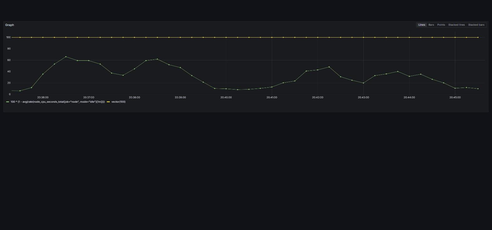
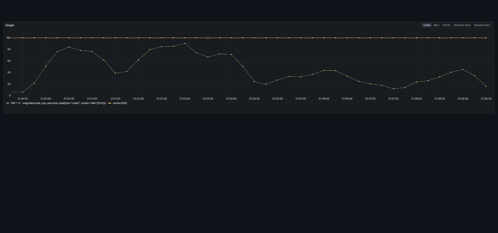
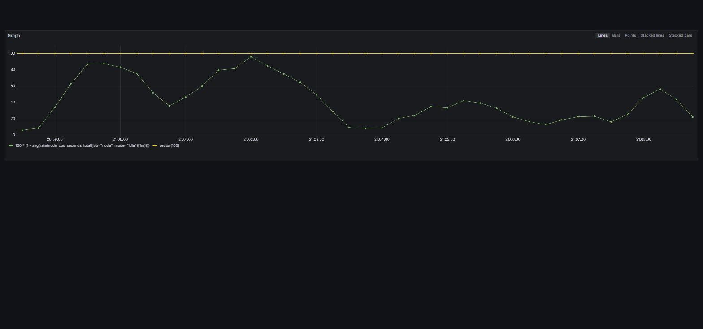
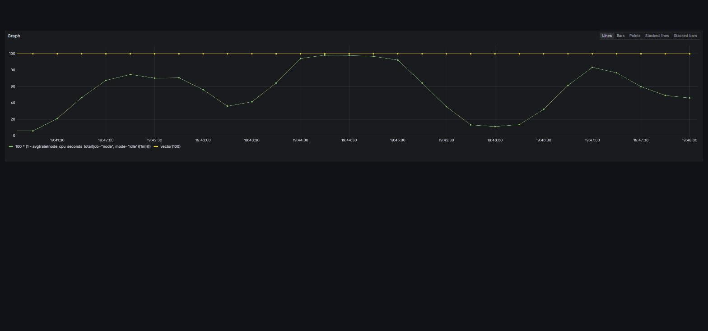
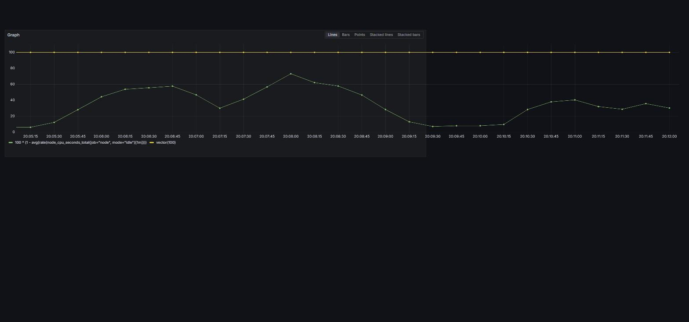

# #555 admit-rate 무릎 실측 — 리포트

- **시리즈**: `260814-555-admit-rate-knee`
- **일자**: 2026-08-14 (UTC)
- **대상**: `https://api.ticketrush.store` — 단일 EC2 `m7i-flex.large`(2 vCPU / 7.6 GiB), 앱 8개 + Kafka·MySQL·Redis·관측 스택 동거 (ADR 0006 · ADR 0007)
- **배포본**: `IMAGE_TAG=b0f3da8464498eaf1e595ac2e478167fb3afee27` — 전 회차 동일. 회차 중 배포 없음
- **생성기**: 로컬 Docker, `ticketrush/k6-sse:local` (xk6 빌드)
- **판정 기준**: 회차 전 `metadata.txt`에 확정 (커밋 `7ce665b0`, 첫 계단 이전)

---

## 1. 답

**`queue.admit-rate-per-second`의 무릎은 12와 16 사이다. 현행 운영값 20은 무릎보다 위다.**

첫 포화 계단은 **16**이고 그 아래 계단 **12**가 통과한다 — 사전 확정한 `STOP_RULE`("첫 포화 계단을 찾고 그 아래 한 계단이 통과하면 종료") 충족.

**무릎을 만드는 것은 admit 자체가 아니라 admit에 비례해 커지는 SSE 팬아웃이다.** 구독자를 고정 100명으로 두면 팬아웃 sends/s = `100 × m`이므로 admit이 곧 seat-service의 부하다. 이슈 본문이 세운 두 가설 중 **두 번째("SSE 구독자 누적이 먼저 걸린다면 20보다 낮을 수도")가 맞았다.**

회차 전에 적어 둔 예측 `PREDICT_KNEE=25~30/s`는 **틀렸다.** 방향도 낙관 쪽으로 틀렸고, 예측이 지목한 축(좌석맵 CPU)이 아니라 SSE 팬아웃이 무릎을 만들었다.

---

## 2. 계단 대조표

계단 산술은 `a = 2m`(도착률) · `C = 300m`(코호트) · 유입 유지 140s로 고정했다. 소화 시간이 어느 계단에서나 300초로 같아 동일한 5분 판정창(15초 스크랩 × 약 11표본)이 확보된다. 판정창은 `t+150s ~ t+310s`.

### 호스트 CPU — 계단이 올라가며 수렴한다

세 장 모두 Y축을 0-100%로 고정했으므로 그대로 겹쳐 읽을 수 있다.

| `b12` (admit 12) | `b16` (admit 16) | `b20` (admit 20) |
|---|---|---|
|  |  |  |
| max 66.04% | max 90.53% | max 95.91% |

`b12`는 천장에서 한참 떨어져 있고, `b16`부터 100% 선에 닿기 시작하며, `b20`은 붙는다. 세 신호 중 "호스트 CPU 수렴"이 `b16`에서 이미 서 있음을 보여 준다.

### 시리즈 B (백로그 수정 후 — 결론의 근거)

| arm | admit | 예매RPS avg | 소화s(max) | 폴링RPS | GW RPS | CPU avg/max | 좌석맵 성공 | 폴링 p95 | 판정 |
|---|---|---|---|---|---|---|---|---|---|
| `b12` | 12 | 8.22 | 407.5 | 258.9 | 310.7 | 34.70 / 61.89 | **99.49%** | 2.03s | **통과** |
| `b16` | 16 | 9.84 | 363.2 | 119.9 | 189.9 | 70.89 / 90.53 | **63.51%** | 30.95s | **첫 포화** |
| `b20` | 20 | 13.02 | 322.8 | 108.7 | 232.0 | 61.30 / 95.91 | 73.26% | 40.23s | 무릎 위 |

> **⚠️ 표의 순서는 admit 오름차순이고, 실행 순서는 그렇지 않다.** 실제 순서는 `b12`(11:35) → **`b20`(11:58) → `b16`(12:19)**이다(시리즈 A는 `a20` → `a12` → `a16` → `a16-nosse`). 두 시리즈 모두 **16이 20보다 뒤에 돌았고** 계단 사이 서비스 재시작이 없다 — `b20`이 `b16`보다 좋게 나온 역전을 읽을 때 §6 `LIMIT_ORDER`를 함께 본다.

### 시리즈 A (백로그 수정 전 — 독립 확인)

| arm | admit | 예매RPS avg | 소화s(max) | CPU max | 좌석맵 성공 | GW 500 | 판정 |
|---|---|---|---|---|---|---|---|
| `a12` | 12 | 9.23 | 359.0 | 65.32 | **100.00%** | 0 | 통과 |
| `a16` | 16 | 9.98 | 471.3 | 98.39 | **63.06%** | 1,034 | 포화 (형식상 무효 — §5) |
| `a16-nosse` | 16 | 9.95 | 413.3 | 73.22 | **100.00%** | — | 통과 (SSE 대조) |
| `a20` | 20 | 12.26 | 356.3 | 97.78 | 38.14% | 1,898 | 무효 (§5) |

---

## 3. 판정 근거

### 3.1 처리량 정체 — `PRIMARY_CRITERION`

사전 기준: *"직전 계단 대비 admit 증가분의 50% 미만만 오르는 계단."*

| 구간 | admit 증가 | 예매 서버 RPS 증가 | 비율 | 판정 |
|---|---|---|---|---|
| 시리즈 B `12 → 16` | +4 | 8.22 → 9.84 = +1.62 | **40.5%** | 포화 |
| 시리즈 B `16 → 20` | +4 | 9.84 → 13.02 = +3.18 | 79.5% | 기준 위 |
| 시리즈 A `12 → 16` | +4 | 9.23 → 9.98 = +0.75 | **18.8%** | 포화 |

**두 시리즈는 대상 설정이 달라 절대값으로 잇지 않는다. 그럼에도 판정이 독립적으로 같은 곳을 가리킨다** — 이것이 이 결론의 근거다.

### 3.2 포화 축은 seat-service — 세 갈래 증거

**① 좌석맵 성공률이 12와 16 사이에서 절벽처럼 떨어진다. 두 시리즈에서 재현됐다.**

| admit | 시리즈 A | 시리즈 B |
|---|---|---|
| 12 | 100.00% | 99.49% |
| 16 | **63.06%** | **63.51%** |
| 20 | 38.14% | 73.26% |

독립 회차에서 admit 16의 값이 63.06% / 63.51%로 소수점까지 가깝게 나왔다. 우연으로 보기 어렵다.

**② 자원 축이 seat-service를 지목한다.** `a16`에서 Hikari `pending` max 36 / `active` max 10 — 커넥션 풀(10)을 넘어 요청이 쌓였다. Tomcat busy max 26-50, 컨테이너 메모리 상한 도달. 정작 그 서비스의 HTTP는 **2.18 RPS**뿐이다 — CPU를 먹는 것은 HTTP 경로가 아니다.

`a20`의 프로세스 CPU 합계가 호스트 포화를 설명한다: seat 0.442 + gateway 0.257 + booking 0.219 = **1.83 / 2 vCPU**(호스트 max 97.8%). 최대 소비자가 seat-service다.

**③ SSE 대조 회차가 인과를 확정한다.** `a16`과 모든 조건이 같고 `QUEUE_SSE_SUBSCRIBERS`만 100 → 0:

| 지표 | `a16` (구독자 100) | `a16-nosse` (0) | 차이 |
|---|---|---|---|
| 좌석맵 성공률 | 63.06% | **100.00%** | +36.94%p |
| `queue_status_unavailable` | 76건 | **0건** | 무효 조건이 사라진다 |
| 폴링 p95 | 2.73s | **180.25ms** | 15.1배 |
| 승급 후 소요 avg | 1.04s | 0.42s | 2.5배 |
| 소화 시간 max | 471.3s | 413.3s | −58.0s |
| 호스트 CPU avg | 64.61% | **33.65%** | −30.96%p |
| 예매 서버 RPS avg | 9.98 | 9.95 | 차이 없음 |

**구독자 100명이 호스트 CPU를 avg 약 31%p 먹고 있었고, 그것이 좌석맵과 폴링을 밀어냈다.** admit 16 자체는 이 여정을 감당한다.

| 구독자 100명 (`a16`) | 구독자 0명 (`a16-nosse`) |
|---|---|
|  |  |

두 장의 Y축은 쿼리에 얹은 `vector(100)` 상수 계열(노란 수평선)로 **0-100%에 고정했다.** 자동 스케일이면 두 장 모두 화면을 가득 채워 차이가 사라진다 — 이 회차에서 가장 중요한 캡처 함정이라 `grafana-capture-links.md`에 못 박았다.

### 3.3 소화 시간 — `SECONDARY`

`queue_drain_seconds`의 max(k6 요약이 유일한 출처 — Trend의 max는 remote-write로 나가지 않는다). 모델값 `C/m = 300s` 대비:

| arm | 실측 max | 모델 대비 |
|---|---|---|
| `a12` | 359.0s | 1.20배 |
| `a16` | 471.3s | **1.57배** |
| `a16-nosse` | 413.3s | 1.38배 |
| `b12` | 407.5s | 1.36배 |
| `b16` | 363.2s | 1.21배 |
| `b20` | 322.8s | 1.08배 |

시리즈 A의 `12 → 16`이 **359.0s → 471.3s로 31% 느려진 것**이 가장 선명한 신호였다 — 허용량을 올렸는데 소화가 더 느려졌다.

⚠️ 계단마다 진입 실패로 실효 코호트가 달라 절대값을 나란히 놓고 단조성을 논할 수 없다(§4).

#### 1만 명 기준으로 환산하면

이슈 본문의 표(`admit 20` → 8분 20초 등)는 `10,000 / m`이다. 이번 회차는 코호트가 계단마다 다르므로(`C = 300m`) **실효 승급 인원 ÷ 실측 소화 시간**으로 처리율을 구해 1만 명으로 늘린다.

| arm | admit | 승급 인원 | 실측 소화(max) | 실효 처리율 | **1만 명 환산** | 이론 `10000/m` | 이론 대비 |
|---|---|---|---|---|---|---|---|
| `a12` | 12 | 2,780 | 359.0s | 7.74/s | **21분 31초** | 13분 53초 | 1.55배 |
| `b12` | 12 | 2,772 | 407.5s | 6.80/s | **24분 30초** | 13분 53초 | 1.76배 |
| `a16` | 16 | 3,845 | 471.3s | 8.16/s | **20분 25초** | 10분 25초 | 1.96배 |
| `a16-nosse` | 16 | 3,717 | 413.3s | 8.99/s | **18분 31초** | 10분 25초 | 1.78배 |
| `b16` | 16 | 3,300 | 363.2s | 9.09/s | **18분 20초** | 10분 25초 | 1.76배 |
| `b20` | 20 | 3,867 | 322.8s | 11.98/s | **13분 54초** | 8분 20초 | 1.67배 |

**어느 계단에서도 이론값의 1.5-2배가 걸린다.** 대기열이 `m`명/초로 승급시켜도 그 사람이 좌석맵을 받고 예매를 마치기까지가 그만큼 늘어지기 때문이고, 그 지연이 곧 §3.2의 포화 축이다.

> ⚠️ **이 환산은 외삽이다.** 실제로 1만 명을 넣은 회차가 아니라 2,772-3,867명을 넣고 얻은 처리율을 선형으로 늘린 값이다. 대기 인원이 3배가 되면 `ZRANK` 비용과 동시 커넥션이 함께 늘어 처리율이 더 떨어질 가능성이 크므로 — 즉 **낙관 쪽으로 치우친 하한 추정**이다. #549가 커넥션 1,600 → 16,701에서 `R`이 1,400 → 450 RPS로 3.1배 떨어지는 것을 실측한 전례가 그 근거다.
>
> 코호트를 1만으로 고정하지 않은 이유는 §6 `LIMIT_COHORT`에 있다 — 고정하면 상위 계단의 판정 표본이 4개로 줄어 판정 자체가 서지 않는다. **판정 가능성과 이슈 표와의 직접 비교 중 판정을 택했다.**

#### 완주를 좌석맵 통과까지로 정의하면 — 주 지표를 다시 센다

**위 표는 `admit 20`을 가리킨다.** 13분 54초 대 24분 30초로 1.76배다. 그런데 그 표의 "완주"는 `queue_drain_seconds`의 정의를 그대로 따른 것이고, **그 정의가 실사용자의 완주와 다르다.**

`waiting-room.js:451-466`을 보면 좌석맵 GET이 실패해도 그대로 `bookSeat()`을 호출한다. 좌석은 `seatFor(idx)`로 미리 배정돼 있어 여정에 좌석맵이 필요 없기 때문이다. 그리고 `drainSeconds`는 **예매 성공만** 기록한다. 그래서 두 지표가 이렇게 갈린다:

| arm | `queue_seatmap_ok` | `queue_booking_ok` |
|---|---|---|
| `b16` | 63.51% | 98.00% |
| `b20` | 73.26% | 99.12% |

**좌석맵을 못 본 사람이 완주자로 세어지고 있다.** 실사용자는 좌석맵 없이 좌석을 고를 수 없으므로 위 표는 상위 계단 쪽으로 편향돼 있다. 완주를 **좌석맵 통과 + 예매 성공**으로 다시 정의해 같은 환산을 한다.

| arm | admit | 승급 | 좌석맵 통과 | 예매 성공 | **완주자** | 완주 처리율 | **1만 명 환산** |
|---|---|---|---|---|---|---|---|
| `a12` | 12 | 2,780 | 100.00% | 99.96% | 2,779 | 7.74/s | **21분 32초** |
| `b12` | 12 | 2,772 | 99.49% | 99.56% | 2,758 | 6.77/s | **24분 38초** |
| `a16` | 16 | 3,845 | 63.06% | 99.89% | 2,425 | 5.15/s | **32분 24초** |
| `b16` | 16 | 3,300 | 63.51% | 98.00% | 2,096 | 5.77/s | **28분 53초** |
| `a20` | 20 | 3,193 | 38.14% | 82.77% | 1,218 | 3.42/s | **48분 46초** |
| `b20` | 20 | 3,867 | 73.26% | 99.12% | 2,833 | 8.78/s | **18분 59초** |
| `a16-nosse` | 16 | 3,717 | 100.00% | 99.97% | 3,716 | 8.99/s | **18분 32초** |

> ⚠️ **완주자는 상한 추정이다.** 두 성공 집합이 완전히 겹친다고 가정한 값(`min`)이라 실제 완주자는 이보다 적을 수 있고, **겹침이 덜할수록 상위 계단이 더 불리해진다.** 즉 이 표조차 상위 계단 쪽에 유리하게 기울어 있다.
>
> ⚠️ `a20`은 백로그 수정 **전**이다(§4). `b20`과 나란히 놓을 때 그 사실을 함께 읽는다.

**① `admit 16`은 두 회차 모두 12보다 느리다.** 32분 24초 · 28분 53초 대 21분 32초 · 24분 38초다. 허용량을 12에서 16으로 올리면 완주 처리율이 **떨어진다**(7.74·6.77/s → 5.15·5.77/s). §3.1의 `PRIMARY_CRITERION`이 예매 서버 RPS로 잡아낸 것과 방향이 같다 — **주 지표 축에서도 같은 결론이 나온다.**

**② `admit 20`은 기대값이 아니라 분산이 문제다.**

| admit | 최선 | 최악 | 편차 |
|---|---|---|---|
| 12 | 21분 32초 | 24분 38초 | **1.14배** |
| 20 | 18분 59초 | **48분 46초** | **2.57배** |

같은 `admit 20`이 조건에 따라 19분이 되기도 49분이 되기도 한다. `a20`에서는 예매 자체가 82.77%로 무너졌다. **티켓 오픈은 재시도가 없는 일회성 이벤트라 기대값이 아니라 최악값으로 설계한다.**

**③ 그 분산을 만드는 것이 팬아웃이라는 것을 `a16-nosse`가 이 축에서도 보여 준다.** 같은 `admit 16`에서 구독자만 100 → 0으로 두자 **32분 24초 → 18분 32초**다. **팬아웃이 주 지표에서 1.75배를 먹고 있다.** 구독자를 뺀 16은 이 표에서 가장 빠른 축에 든다 — 즉 **막고 있는 것은 `admit`이 아니다**(§3.2 · §7.2).

> `b20`의 18분 59초를 "백로그를 고쳤으니 20의 진짜 실력"으로 읽을 수 있다. 그러나 그 값에는 아직 **실전 요인 셋이 빠져 있고 전부 20에 불리하다.** (i) 구독자를 100명으로 **고정**해 쟀는데 실제 동시 구독자 ≈ `admit × 좌석 선택 화면 체류시간`이라 팬아웃 비용이 `admit²`로 커진다(§7.2 · #403은 600명까지 검증). (ii) 결제·티켓 발급이 여정에 없는데(§6 `LIMIT_PAYMENT`) `b20`은 이미 호스트 CPU max 95.91%다(`b12`는 61.89%). (iii) 좌석맵 실패자가 재시도하지 않는다 — 실사용자 27%는 새로고침해 부하를 더한다.

### 3.4 오버셀 — `POST_CHECK`

런북 §13.4-(7)**(a1)** 상태 무관 검사. 전 회차 **0행**:

| arm | performance_id | bookings / distinct_seats / distinct_users |
|---|---|---|
| `a12` | 34 | 2,780 / 2,780 / 2,780 |
| `a16` | 35 | 3,842 / 3,842 / 3,842 |
| `a16-nosse` | 36 | 3,717 / 3,717 / 3,717 |
| `b12` | 37 | 2,765 / 2,765 / 2,765 |
| `b20` | 38 | 3,846 / 3,846 / 3,846 |
| `b16` | 39 | 3,236 / 3,236 / 3,236 |

**포화가 좌석 정합성을 깨뜨리지는 않았다.** 느려질 뿐 이중 배정으로 넘어가지 않는다. SQL 원문은 `oversell-*.txt`.

⚠️ `a20`은 남기지 못했다 — 계단 사이 절차가 `cleanup`(코호트 삭제) → 재시딩 순서라 다음 계단 준비 시점에 대상이 지워졌다. 사후 조회는 0행이 나오지만 그것은 "오버셀 없음"이 아니라 **"검증 대상 없음" = 검출력 0**이다. 런북 §16.7에 오버셀 검증을 `cleanup` 앞 순서로 못 박았다.

---

## 4. 회차 도중 찾은 것 — nginx/커널 백로그

**시리즈 A 네 회차 모두에서 유입의 17-20%가 대기열 진입에 실패했다**(`queue_enqueue_failed`). 원인을 k6의 `status` 태그가 갈랐다 — `a16-nosse`의 921건은 **전부 `status=0`**, 즉 HTTP 응답을 받지 못한 것(서버 응답이 아니라 전송 계층 실패)이었다.

k6 로그의 실제 오류: `dial tcp <IP>:443: connect: connection refused` 1,650건 · `EOF` 485건 · `dial: i/o timeout` 188건.

대상 커널 카운터가 확정했다:

```
net.ipv4.tcp_max_syn_backlog   512      ← SYN 큐
nginx :443 accept 백로그        511      ← listen 에 backlog= 가 없어 nginx 기본값
net.core.somaxconn             4096     ← 커널은 여유가 있는데 nginx 가 더 낮게 잡는다
TcpExtListenOverflows          0        ← accept 큐는 넘치지 않았다
TcpExtTCPReqQFullDoCookies     15,826   ← SYN 큐가 15,826번 넘쳐 SYN 쿠키로 폴백했다
```

**벽은 애플리케이션도 생성기도 아닌 TCP SYN 큐였다.** 부하 도구만의 문제가 아니라 **실제 티켓 오픈에서도 같은 벽에 닿는다.**

고쳤다(`[Infra] #555` 커밋): nginx `listen 443 ssl backlog=4096`, `tcp_max_syn_backlog 512 → 8192`, `somaxconn 4096 → 8192`, `netdev_max_backlog 1000 → 8192`. 저장소 기록은 `deploy/nginx/api.ticketrush.store.conf` · `deploy/sysctl/99-ticketrush.conf`(CD가 배포하지 않으므로 적용은 수동이다).

**효과 확인**: 시리즈 B 세 회차 모두 `TCPReqQFullDoCookies` 증가 **0**, `ListenOverflows` **0**. admit 20 / 도착률 40에서도 넘치지 않는다. 시리즈 A `a20`의 붕괴(HTTP 500 1,898건 · 좌석맵 38%)와 시리즈 B `b20`(500 없음 · 좌석맵 73%)의 차이가 그 효과다.

**다만 진입 실패 자체는 줄지 않았다**(`a12` 698 → `b12` 705). 남은 원인은 대상이 아니다 — 같은 창에서 대상의 `TcpAttemptFails`는 **70건**뿐인데 k6는 `connection refused`를 **1,260건** 봤고, 대상은 `TcpRetransSegs 263,142` · `TCPLostRetransmit 119,077`을 기록했다. **로컬 생성기와 EC2 사이 WAN 경로의 유실**이며 ADR 0004 토폴로지의 한계다(§6).

---

## 5. 사전 기준의 결함 두 건 — 기록만 하고 고치지 않았다

### 5.1 `queue_status_unavailable > 0`을 단독 무효 조건으로 둔 것

`INVALID_IF`로 못 박고 시작했는데 **`a16`과 `a20`에서 연달아 걸렸다.** 두 계단 모두 **Redis는 멀쩡했다** — `used_memory` 5-6 MB(상한 48 MB), `rejected_connections` 0, `blocked_clients` 0, 명령 처리 max 956/s. 걸린 것은 호스트 CPU 98%뿐이었다.

런북 §16.4가 이미 적어 둔 그대로다: *"`RedisCommandTimeoutException`을 Redis 장애로 읽지 않는다 — 게이트웨이가 CPU를 못 잡으면 서버가 즉답해도 터진다."*

**즉 이 지표는 포화의 결과이기도 해서, 무릎을 찾는 회차에서 무릎을 무효로 만든다.** 규칙을 결과에 맞춰 고치지 않았다 — `a16`·`a20`은 INVALID로 남긴다. 대신 시리즈 B **시작 전에** 두 단계 판정으로 다시 못 박고(런북 §16.6) 새 규칙은 시리즈 B에만 적용했다:

> `queue_status_unavailable > 0`이면 같은 창의 Redis 상태를 먼저 본다. 이상 징후가 있으면 무효(원래 의도), 멀쩡하면 무효가 아니라 **포화 신호로 기록**한다.

### 5.2 세 신호 중 "처리량 정체를 우선한다"가 너무 늦게 켜진다

`b20`에서 처리량은 아직 오르는 중이었다(`16 → 20`이 증가분의 79.5%). 그런데 같은 계단에서 **좌석맵 요청의 26.7%가 실패하고 폴링 p95가 40초**다. 무릎 직후의 전형적인 모습 — 처리량은 오르는데 품질이 먼저 무너진다.

처리량 정체를 최우선으로 둔 기준은 이 시스템에서 사용자가 겪는 붕괴보다 늦게 켜진다. **한계로 기록하고 이번 회차에서 고치지 않았다.**

**늦게 켜지는 원인은 기준이 아니라 여정 계측에 있다.** 이 여정은 좌석맵 GET이 실패해도 예매를 그대로 진행하므로(`waiting-room.js:451-466`, §6 `LIMIT_JOURNEY_SEATMAP`), **주 판정 지표인 예매 서버 RPS가 탐지하려는 고장 모드(좌석맵 붕괴)에 구조적으로 둔감하다.** `b16`의 좌석맵 63.51% / 예매 98.00%가 그 둔감함의 크기다. 임계를 조이는 것으로는 해결되지 않고 **중간 단계 실패를 최종 단계로 전파해야** 지표가 반응한다. 다만 완주자로 다시 세면 이 축에서도 같은 판정이 나온다(§3.3) — **이번 회차의 결론은 이 결함에 걸려 있지 않다.**

---

## 6. 이 회차가 답하지 못하는 것

- **`LIMIT_GENERATOR`** — 로컬 생성기와 EC2 사이 WAN 경로가 유실이 크다(`TcpRetransSegs 263,142` · `TCPLostRetransmit 119,077`). 계단마다 유입의 17-20%가 전송 계층에서 잘려 실효 코호트가 줄었고, 예매 서버 RPS가 어느 계단에서나 8-13/s에 묶였다. **처리량 축으로 계단을 가르는 힘이 그만큼 약하다** — 결론이 좌석맵·CPU·소화 시간 축에 더 기대는 이유다. 해소하려면 생성기를 같은 리전 EC2로 옮겨야 한다(ADR 0010, #549가 실측으로 기각한 결정을 다시 볼 근거가 생겼다).
- **`LIMIT_K6_TIMESERIES`** — 시리즈 A에서 k6 remote-write가 SSH 터널째 끊겼다. 호스트 CPU가 97%대로 차면 sshd가 keepalive에 응답하지 못해 세션이 끊긴다 — **포화를 재려는 회차일수록 관측 경로가 먼저 끊기는 구조**다. 자동 재접속 래퍼로 바꿔 `a16`부터 회복됐고, 그 덕에 들어온 `k6_queue_enqueue_failed`의 `status` 태그가 §4 진단의 결정적 근거가 됐다. `a12`·`a20`의 k6 시계열은 비어 있다.
- **`LIMIT_COHORT`** — 코호트가 계단마다 다르다(`C = 300m`). 소화 시간의 절대값을 계단끼리 직접 비교할 수 없다. 고정하면 상위 계단의 판정 표본이 4개로 줄어 못 쓴다.
- **`LIMIT_ORDER`** — 계단을 이어 돌았고 MySQL을 재시작하지 않았다(G11, 전 계단 동일 적용). 뒤 계단이 버퍼풀 워밍업에서 유리하다. 순서를 뒤집은 대조가 없다. **그리고 실행 순서는 admit 오름차순이 아니다** — 시리즈 A `a20`(08:26) → `a12`(08:56) → `a16`(10:41) → `a16-nosse`(11:05), 시리즈 B `b12`(11:35) → **`b20`(11:58) → `b16`(12:19)**. 두 시리즈 모두 **16이 20보다 뒤에 돌았다.** `b20`(73.26%)이 `b16`(63.51%)보다 좋게 나온 역전에 순서 효과를 배제할 수 없다. 다만 시리즈 A의 마지막 arm `a16-nosse`가 100.00%로 가장 좋았으므로 **누적 열화만으로 설명되지도 않는다** — 어느 쪽도 단정하지 않는다.
- **`LIMIT_JOURNEY_SEATMAP`** — **여정이 좌석맵 실패를 예매로 전파하지 않는다.** `waiting-room.js:451-466`이 좌석맵 GET 결과와 무관하게 `bookSeat()`을 호출하고, 좌석은 `seatFor(idx)`로 미리 배정돼 있어 여정에 좌석맵이 필요 없다. 그래서 `queue_booking_ok`·`queue_drain_seconds`·예매 서버 RPS가 **좌석맵을 못 본 사람을 완주자로 센다**(`b16` 63.51%/98.00% · `b20` 73.26%/99.12%). 이 지표들은 **상위 계단 쪽으로 편향돼 있다.** §3.3이 완주자 기준으로 다시 세어 보정했고, §5.2가 이 결함이 판정 기준에 미친 영향이다. **다음 회차의 선행 작업**으로 남긴다 — 다만 좌석맵을 여정의 게이트로 만들면 상위 계단에서 예매 표본이 급감하므로, 그 설계는 판정 표본 확보와 함께 결정해야 한다.
- **`LIMIT_K6_BINARY` / `LIMIT_JOURNEY`** — k6가 xk6 빌드이고 여정에 좌석맵이 추가됐다. #549 B-2 · #554와 절대값으로 직접 잇지 않는다.
- **`LIMIT_PAYMENT`** — 결제·티켓 발급은 여정에 없다. `StubPaymentApprovalClient`는 `@Profile("!prod")` **와** `@ConditionalOnProperty(payment.pg.stub.enabled=true)`의 AND 조건이라 prod에서 실행되지 않는다.
- **상한 미도달** — 계단표의 80·160은 돌지 않았다. 16에서 이미 포화했으므로 위로 올릴 이유가 없었다.

---

## 7. 권고

### 7.1 `queue.admit-rate-per-second` — 20 → 12

현행 20은 무릎(12-16 사이)보다 위다. **마지막으로 깨끗했던 계단이 12**이고, 그 계단에서 좌석맵 99.49% · 폴링 p95 2.03s · 호스트 CPU max 61.89%로 여유가 있다.

**근거는 세 갈래이고, 셋 다 "12가 가장 빠르다"가 아니다.**

1. **16은 실제로 12보다 느렸다 — 두 회차 모두.** 완주(좌석맵 통과 + 예매 성공) 기준 1만 명 환산이 `a16` 32분 24초 · `b16` 28분 53초로, `a12` 21분 32초 · `b12` 24분 38초보다 느리다(§3.3). 허용량을 올렸는데 완주 처리율이 떨어진다. §3.1이 예매 서버 RPS로 잡아낸 판정과 방향이 같다.
2. **20은 기대값이 아니라 분산이 문제다.** 같은 admit 20이 `b20` 18분 59초에서 `a20` 48분 46초까지 **2.57배** 흔들리고, `a20`에서는 예매 자체가 82.77%로 무너졌다. 12의 편차는 1.14배다. **티켓 오픈은 재시도가 없는 일회성 이벤트라 기대값이 아니라 최악값으로 설계한다.**
3. **측정 밖 요인이 전부 20에 불리하다.** 구독자를 100명으로 **고정**해 쟀는데 실제 동시 구독자는 `admit × 체류시간`이라 팬아웃 비용이 `admit²`로 커지고(§7.2), 결제·티켓 발급이 여정에 없는데(§6 `LIMIT_PAYMENT`) `b20`은 이미 호스트 CPU max 95.91%이며, 좌석맵 실패자 27%의 재시도 부하가 모델에 없다.

값의 근거를 주석에 남긴다 — 현재 주석은 #344의 258 RPS를 인용하는데, **그 258 RPS는 예매 처리량이 아니다**(98.61%가 좌석 점유 반려 409였고 실제 예매 생성은 약 3.3 RPS). 그 문장은 지워야 한다.

⚠️ 12도 무릎의 정확한 값이 아니라 **"통과가 확인된 가장 높은 계단"**이다. 12와 16 사이는 재지 않았다.

⚠️ **그리고 12는 고정 상수다.** 부하는 시간에 따라 변하는데 값은 변하지 않으므로, 12는 **최악 계단에 맞춘 보수적 값**이고 평시에는 그만큼 손해를 본다. 정석은 하류 신호(좌석맵 p95 · seat-service CPU · Hikari `pending`)를 읽어 허용량을 올렸다 내렸다 하는 **적응형 유입 제어**다. 이번 회차의 범위 밖이고 별도 이슈 대상이다 — 다만 `admit`을 상수로 두는 한 이 손해는 남는다는 사실을 값과 함께 기록한다.

### 7.2 SSE 구독자 축을 별도 이슈로

무릎을 만드는 것이 admit이 아니라 SSE 팬아웃이므로, **admit을 낮추는 것은 증상 완화**다. 근본은 seat-service의 팬아웃 비용이다(구독자 100명 기준 sends/s = `100 × m`). `a16-nosse`가 그 인과를 확정했다 — 구독자를 빼면 같은 admit에서 좌석맵이 100%로 돌아온다.

### 7.3 백로그는 이미 반영했으나 인스턴스 재생성 시 유실된다

CD가 nginx·sysctl을 배포하지 않는다. 저장소는 기록본이고 적용은 수동이다. **인스턴스를 새로 만들면 다시 넣어야 한다** — 프로비저닝 자동화가 별도 이슈로 남는다.

### 7.4 ADR 0009 갱신

§3·§5가 `R`을 #546 실측으로 갱신한 것과 같은 방식으로, admit rate의 근거를 이 회차 수치로 채운다. 현재 ADR에는 admit rate의 실측 근거가 없다.
